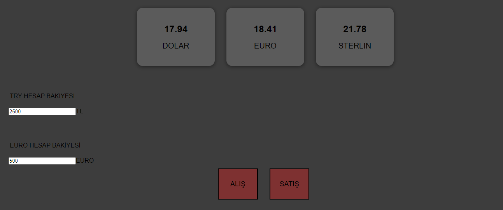

# Investment -Account
 <i>Program that allows people to trade in investment accounts.</i>
## *Purpose of use of the project*  
To begin with, when you enter this website, an introduction section greets you. 
Then you need to log in with your username and password. We check the correctness of the username or password using <b><i>JavaScript.</i></b>
If it is correct, the code allows us to move to the next page. 

After successfully logging in, another <b>Html</b> page greets us. There are buttons here where you have a dollar, euro or sterling investment account. Each investment account is designed to be another <b>Html</b> file. When you select the investment account you want to trade and switch to another <b><i>Html</i></b> page.  After selecting your investment account, your Turkish lira and dollar,euro or sterling balance will appear. If you have selected your dollar account, the dollar will appear. Then, when you want to make a transaction, we ask the user how much to buy or sell with the *`function`* file *`var x=prompt`* expression that we have written in <b><i>JavaScript.</b></i> Then we inform the user of the current balance with alert according to the user's balance with conditional expressions *if / else.*   
<b><i>Project images;</i><b>
  

  

  

